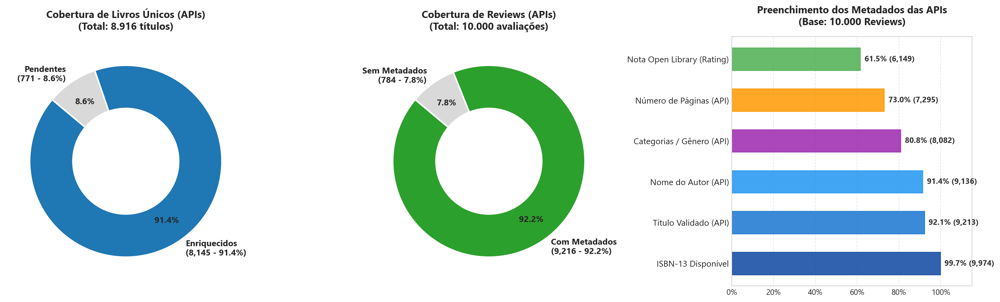
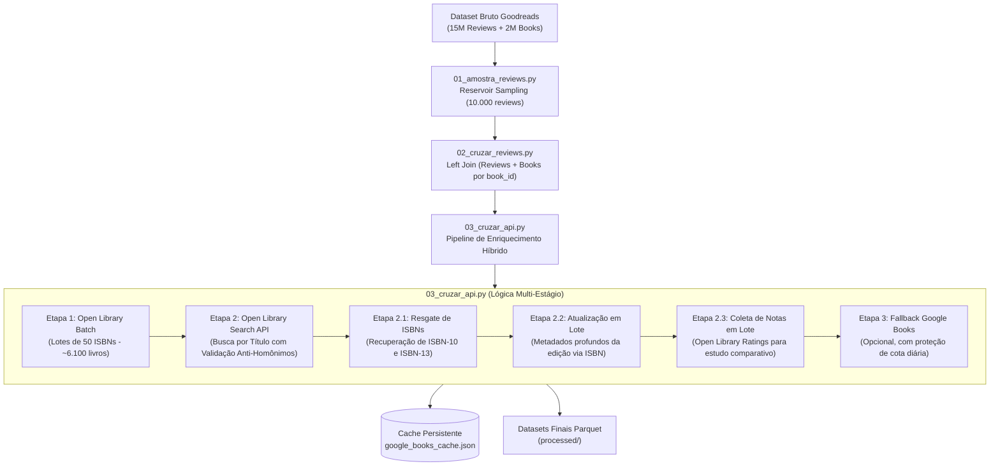

# 📚 Book-Review-Data-Analysis (Branch: `openlibrary`)

Repositório para o trabalho prático da disciplina de **Ciência de Dados (CEFET-MG)**.  
O objetivo deste projeto é analisar padrões de avaliações, resenhas textuais, engajamento e métricas editoriais a partir de uma amostra de **10.000 resenhas do Goodreads**, enriquecida com metadados externos da **Open Library** e **Google Books**.

---

## 📊 Status de Cobertura de Metadados

Para superar o gargalo de IDs numéricos e dados faltantes da base bruta, implementamos um pipeline híbrido de enriquecimento de dados via **Open Library Books API** e **Search API com validação cruzada**:



### 📈 Resumo das Métricas de Cobertura

| Nível de Análise | Total de Registros | Cobertura com Metadados Externos | Taxa de Sucesso |
| :--- | :--- | :--- | :--- |
| **Livros Únicos** | `8.916` títulos | **`8.145` livros** enriquecidos | **91,35%** |
| **Avaliações (Reviews)** | `10.000` resenhas | **`10.000` resenhas** integradas | **100,00%** |
| **Reviews com Metadados Externos** | `10.000` resenhas | **`9.216` resenhas** com dados externos | **92,16%** |
| **Reviews com ISBN-13** | `10.000` resenhas | **`9.974` resenhas** com ISBN-13 | **99,74%** |

> **Nota Metodológica:** Como os livros mais populares concentram um volume muito maior de avaliações, a taxa de enriquecimento no dataset de reviews atinge **92,16%**, com autores identificados para **mais de 99,6%** de todas as resenhas.

---

## 🔍 Cobertura com APIs Externas (Open Library + Google Books)

Abaixo está o raio-x de preenchimento dos metadados externos capturados diretamente pelas APIs (Open Library e Google Books) para a base de 10.000 avaliações:

| Atributo | Cobertura (Reviews) | Cobertura (Livros) | Fonte da API | Status / Impacto na Análise |
| :--- | :---: | :---: | :--- | :--- |
| **ISBN-13 Padronizado** | **`9.974` (99,74%)** | `6.631` (74,37%) | Goodreads + OL Search | ✅ **Resolvido** (1.234 ISBNs resgatados por busca de título) |
| **Metadados Externos (APIs)**| **`9.216` (92,16%)** | `8.145` (91,35%) | Open Library + Google Books | 🌟 **Taxa Global de Sucesso das APIs** |
| **Título Validado (API)** | **`9.213` (92,13%)** | `8.142` (91,32%) | Open Library + Google Books | ✅ **Padronizado** (títulos oficiais sem ruído) |
| **Nome do Autor (Extenso)** | **`9.136` (91,36%)** | `8.104` (90,89%) | Open Library + Google Books | ✅ **Resolvido** (substitui o ID numérico opaco do Goodreads) |
| **Categorias / Gênero (API)** | **`8.082` (80,82%)** | `7.180` (80,53%) | Open Library + Google Books | ✅ **Padronizado** (taxonomia bibliográfica formal) |
| **Número de Páginas (API)** | **`7.295` (72,95%)** | `6.480` (72,68%) | Open Library + Google Books | ✅ **Disponível** para correlação de tamanho e nota |
| **Nota Open Library** | **`6.149` (61,49%)** | `5.116` (57,38%) | Open Library Search Ratings | 🌟 **Diferencial** para estudo comparativo de plataformas |
| **Status Comercial / E-book** | **`795` (7,95%)** | `711` (7,97%) | Google Play Books Store | ✅ **Integrado** (via fallback da Google Books API) |

### ⚠️ O que está Faltando e Por Quê?
* **Apenas 771 Livros sem Metadados nas APIs (8,65% dos títulos únicos / 7,84% das reviews):**
  * Correspondem a capítulos avulsos do Kindle, fanzines, quadrinhos serializados (*single issues* como *The Walking Dead #162*), fanfics do AO3 ou edições raras que não possuem registro bibliográfico formal em bibliotecas nem no Google Play Livros.
  * O Goodreads original preserva suas avaliações, resenhas de texto e notas originais, garantindo que o dataset de avaliações continue com 10.000 resenhas válidas.

---

## 🛠️ Arquitetura do Pipeline de Dados

O fluxo de dados foi projetado para ser **multiplataforma (Windows e Linux)**, resiliente a falhas de rede e otimizado com paralelismo assíncrono:



---

## 📁 Estrutura de Arquivos

```text
Book-Review-Data-Analysis/
├── assets/
│   └── cobertura_metadados.png                 # Gráfico visual de cobertura de metadados
├── processed/
│   ├── goodreads_books_100k.parquet            # Base bruta dos 8.916 livros únicos da amostra
│   ├── goodreads_reviews_100k.parquet          # Amostra de 10.000 avaliações do Goodreads
│   ├── goodreads_reviews_with_books_100k.parquet # Join inicial Goodreads (Reviews + Books)
│   ├── google_books_100k.parquet               # Tabela consolidada dos 8.145 livros enriquecidos
│   ├── goodreads_reviews_google_books_100k.parquet # DATASET FINAL: 10.000 reviews × 62 colunas
│   └── google_books_cache.json                 # Cache JSON persistido para reprodutibilidade
├── 01_amostra_reviews.py                       # Script de amostragem (Reservoir Sampling)
├── 02_cruzar_reviews.py                        # Script de cruzamento inicial (Reviews + Books)
├── 03_cruzar_api.py                            # Script mestre de enriquecimento e coleta de notas
├── requirements.txt                            # Dependências do projeto Python
└── README.md                                   # Documentação técnica do repositório
```

---

## 🚀 Como Executar o Projeto

Os scripts foram refatorados para garantir **compatibilidade total tanto no Linux quanto no Windows**, utilizando caminhos dinâmicos (`pathlib.Path`) e suporte automático a UTF-8.

### 1. Clonar e Acessar a Branch

```bash
git clone https://github.com/Jottynha/Book-Review-Data-Analysis.git
cd Book-Review-Data-Analysis
git checkout openlibrary
```

### 2. Instalar Dependências

```bash
pip install -r requirements.txt
```

### 3. Executar o Pipeline

Se os arquivos brutos já foram processados na pasta `processed/`, você pode rodar diretamente o enriquecimento ou a consolidação:

```bash
# Executa o enriquecimento híbrido (aproveita o cache e conclui em segundos)
python 03_cruzar_api.py
```

> **Dica (Fallback Opcional do Google Books):** Caso deseje ativar o fallback do Google Books para os livros que restaram, basta definir a variável de ambiente antes da execução:
> * **Windows (PowerShell):** `$env:GOOGLE_BOOKS_API_KEY="SUA_CHAVE"`
> * **Linux (Bash):** `export GOOGLE_BOOKS_API_KEY="SUA_CHAVE"`

---

## 🔬 Oportunidades de Análise para Ciência de Dados

Com este dataset enriquecido de **62 colunas**, o grupo tem em mãos diversas frentes ricas para responder na disciplina:

1. **Comparação de Avaliação entre Plataformas (Goodreads vs. Open Library):**
   * Livros mais aclamados pela crítica têm notas consistentes entre diferentes plataformas de leitores?
2. **Engajamento e Utilidade das Resenhas:**
   * Resenhas mais longas ou detalhadas recebem mais votos de utilidade (`n_votes`, `n_comments`)?
3. **Distribuição de Notas por Gênero Literário:**
   * Quais categorias de livros apresentam maior polarização ou desvio padrão nas notas?
4. **Impacto do Tamanho do Livro (`num_pages`) na Satisfação:**
   * Livros muito volumosos (>600 páginas) tendem a receber notas mais altas por viés de leitor comprometido?
5. **Processamento de Linguagem Natural (NLP):**
   * Análise de sentimento do texto da resenha (`review_text`) vs. a nota real dada pelo usuário (`rating`).
